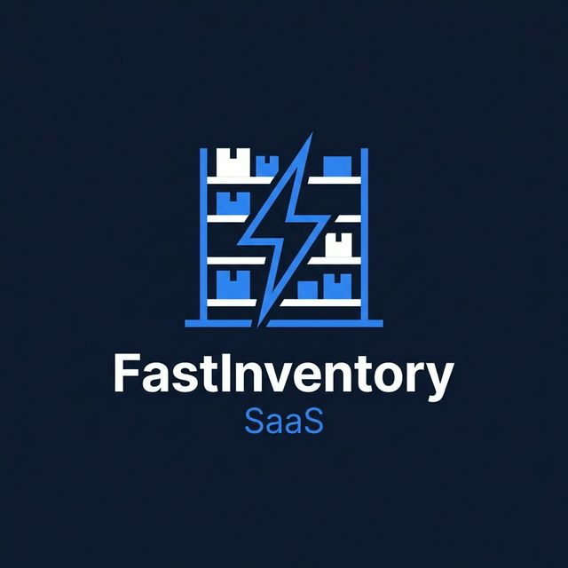

<p align="center">
  
</p>

<h1 align="center">FastInventory SaaS</h1>

<p align="center">
  <strong>Plataforma Multi-Tenant de Gestión de Inventario</strong>
  <br />
  Construida con FastAPI, PostgreSQL, Redis y Docker
</p>

<p align="center">
  
  
  
  
  
  
</p>

---

## 🏢 ¿Qué es FastInventory SaaS?

**FastInventory SaaS** es una API REST de nivel empresarial que permite a múltiples negocios (tenants) gestionar su inventario, ventas y reportes en una única plataforma compartida — con **aislamiento estricto de datos** entre cada empresa.

Diseñada con la metodología **Attribute-Driven Design (ADD)** y siguiendo los principios del **Modular Monolith**, la plataforma ofrece planes de suscripción escalables para negocios de todos los tamaños.

---

## ✨ Características Principales

| Módulo | Descripción |
|---|---|
| 🏗️ **Multi-Tenancy** | Aislamiento de datos estricto por `tenant_id` en todas las queries |
| 🔐 **Autenticación JWT** | Tokens stateless con `tenant_id` embebido y validado en BD |
| 📦 **Gestión de Inventario** | Categorías y productos con caché Redis (TTL 60s) |
| 💰 **Ventas Atómicas** | Descuento de stock transaccional: o todo o nada (ROLLBACK completo) |
| 📊 **Reportes** | Diario, quincenal y mensual. Exportación a **PDF** en memoria |
| 🛡️ **Planes de Suscripción** | Free, Basic, Pro con límites de usuarios y productos |
| 👑 **Super-Admin** | Panel global para suspender/activar tenants y cambiar planes |

---

## 🛠️ Stack Técnico

```
FastAPI 0.111      → Framework web asíncrono de alto rendimiento
SQLAlchemy 2.0     → ORM async con soporte PostgreSQL (asyncpg)
Alembic            → Migraciones de base de datos versionadas
PostgreSQL 14      → Base de datos principal (ACID compliant)
Redis 7            → Caché y propagación de estado (TTL configurable)
FPDF2              → Generación de PDFs en memoria (sin tocar disco)
Python-JOSE        → Creación y verificación de JWT
Bcrypt             → Hashing de contraseñas
Docker Compose     → Orquestación local de 3 servicios (api, db, cache)
```

---

## 🏛️ Arquitectura

El proyecto sigue el patrón de **Modular Monolith** con separación por capas:

```
app/
├── core/               # Configuración, BD, Caché, Seguridad, Dependencias
└── modules/
    ├── tenants/        # Onboarding, registro, perfil del negocio
    ├── auth/           # Login JWT
    ├── users/          # CRUD de empleados con límites de plan
    ├── categories/     # Categorías con caché Redis
    ├── products/       # Inventario con búsqueda ILIKE + caché granular
    ├── sales/          # Ventas atómicas (QAS-01 CRÍTICO)
    ├── reports/        # Reportes + PDF (restringidos por plan)
    └── admin/          # Panel de Super-Admin con auditoría de cambios
```

### Atributos de Calidad Implementados (QAS)

| ID | Atributo | Descripción |
|---|---|---|
| QAS-01 | **Atomicidad** | Venta con N ítems → COMMIT único o ROLLBACK total |
| QAS-03 | **Aislamiento** | JWT con `tenant_id` validado en BD. Datos de otros tenants invisibles |
| QAS-04 | **Rendimiento** | Caché Redis invalidado on-write para categorías y productos |
| QAS-05 | **Escalabilidad** | Índice compuesto `(tenant_id, name)` para búsquedas en <500ms |
| CA-06 | **Sin Disco** | Los PDFs se generan 100% en memoria y se retornan como bytes |
| CA-08 | **Resiliencia** | Si Redis falla, el sistema cae a PostgreSQL transparentemente |

---

## 🚀 Inicio Rápido

### Prerequisitos
- Docker y Docker Compose instalados

### 1. Clonar el repositorio
```bash
git clone https://github.com/tu-usuario/fastinventory-saas.git
cd fastinventory-saas
```

### 2. Configurar variables de entorno
```bash
cp .env.example .env
# Edita .env con tus valores
```

### 3. Levantar los servicios
```bash
docker compose up -d
```

### 4. Aplicar migraciones de base de datos
```bash
docker compose exec api alembic upgrade head
```

### 5. (Opcional) Crear el Super-Administrador
```bash
docker compose exec api python scripts/create_superadmin.py
```

### 6. Explorar la API
Abre tu navegador en **[http://localhost:8000/docs](http://localhost:8000/docs)** para ver la interfaz Swagger interactiva.

---

## 🧪 Flujo de Uso

```
1. POST /auth/register   → Crea tu negocio (Tenant + Admin en 1 paso)
2. POST /auth/token      → Obtén tu JWT
3. POST /categories/     → Crea categorías de productos (Admin)
4. POST /products/       → Registra productos en el inventario (Admin)
5. POST /sales/          → Registra una venta (Admin o Empleado)
6. GET  /reports/daily   → Consulta el resumen del día
7. GET  /reports/daily/pdf → Descarga el PDF (solo Plan Pro)
```

---

## 📋 Planes de Suscripción

| Plan | Usuarios | Productos | Reportes | PDF |
|---|---|---|---|---|
| **Free** | Hasta 2 | Hasta 50 | Solo diario | ❌ |
| **Basic** | Hasta 10 | Hasta 500 | Diario, quincenal, mensual | ❌ |
| **Pro** | Ilimitados | Ilimitados | Todos | ✅ |

---

## 📁 Estructura del Proyecto

```
.
├── app/                    # Código fuente principal
├── alembic/                # Migraciones de base de datos
├── scripts/                # Scripts de administración
│   └── create_superadmin.py
├── docs/                   # Documentación técnica y arquitectónica
├── tests/                  # Tests de integración
├── docker-compose.yml      # Entorno de desarrollo
├── docker-compose.prod.yml # Entorno de producción
├── Dockerfile
├── requirements.txt
└── .env.example            # Plantilla de variables de entorno
```

---

## 📄 Licencia

Este proyecto está bajo la Licencia MIT. Ver [LICENSE](LICENSE) para más detalles.

---

<p align="center">
  <strong>Hecho con ❤️ usando FastAPI y Python</strong>
</p>
