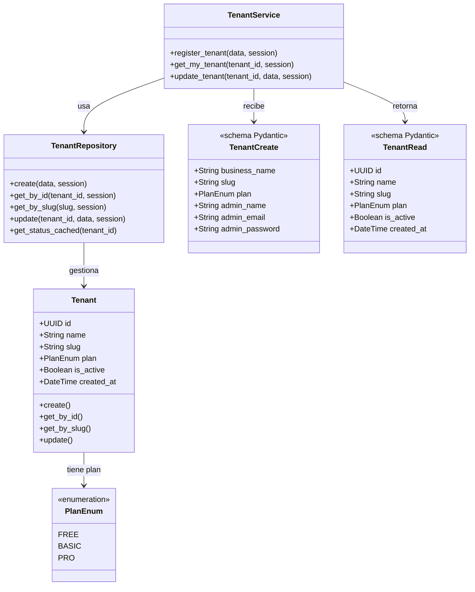
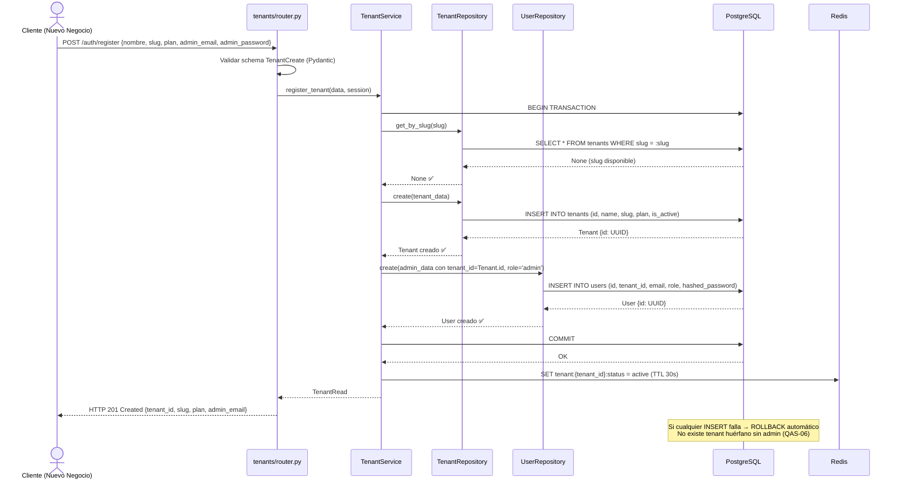
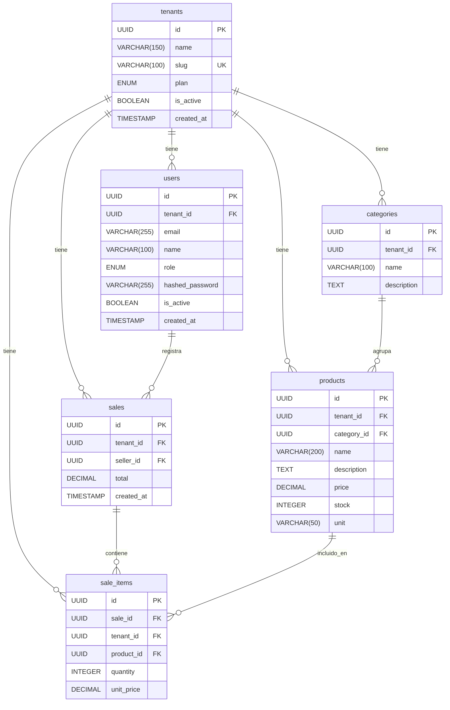

# Iteración ADD-01: Módulo `tenants/`
## Proyecto: FastInventory SaaS

---

**Versión:** 1.0  
**Fecha:** 11/04/2026  
**Metodología:** Attribute-Driven Design (ADD) aplicado sobre QAS/ADR de `drivers_arquitectonicos.md`  
**Módulo:** `app/modules/tenants/`  

---

## Paso 1 — Selección del Elemento a Descomponer

**Elemento:** Módulo `tenants/` — el dominio raíz del sistema SaaS.  
**Justificación de prioridad:** Es el módulo que habilita toda la plataforma. Sin `Tenant`, no hay `tenant_id` y, por lo tanto, no existe aislamiento de datos. Es el primer módulo que debe diseñarse porque todos los demás dependen de su modelo de datos.

**Referencia en documentación:**
- `vision_y_alcance.md` — F-01 (Onboarding Autónomo), F-07 (Planes de Suscripción)
- `drivers_arquitectonicos.md` — CA-02, QAS-03, QAS-06, ADR-06
- `analisis_transicion_saas.md` — Sección 2.1 (Módulo de Tenants)

---

## Paso 2 — Identificación de los Drivers Aplicables

Los siguientes drivers del documento `drivers_arquitectonicos.md` son relevantes para este módulo:

| Driver | ID | Impacto en el módulo `tenants/` |
|---|---|---|
| **Aislamiento de datos** | QAS-03, ADR-06 | La tabla `tenants` es el origen de toda la cadena de `tenant_id`. Su diseño define la integridad del modelo multi-tenant completo. |
| **Atomicidad del onboarding** | QAS-06 | La creación del Tenant y su primer Admin deben ocurrir en una sola transacción SQL. Un fallo parcial no debe dejar un Tenant sin administrador. |
| **Control de acceso por rol** | QAS-02 | Los endpoints de gestión de tenants requieren protección diferenciada: algunos son públicos (registro), otros son scoped al Admin del tenant, y otros exclusivos del Super-Admin. |
| **Mantenibilidad** | QAS-04, ADR-02 | El módulo `tenants/` debe seguir el patrón `Router → Service → Repository` para que otros módulos lo puedan referenciar como dependencia sin acoplamiento. |
| **Restricción Row-Level Tenancy** | CA-02 | La tabla `tenants` es la tabla padre. Todas las demás tablas (`users`, `products`, etc.) tienen `tenant_id UUID FK → tenants.id`. |

---

## Paso 3 — Identificación de Conceptos de Diseño Candidatos

| Decisión de diseño | Opciones | Decisión tomada | Justificación |
|---|---|---|---|
| Estrategia de aislamiento | Schema por tenant / BD por tenant / `tenant_id` en filas | **Row-Level Tenancy** (`tenant_id` en filas) | ADR-06: menor costo operacional, Alembic simple, compatible con SQLAlchemy async. |
| Creación de Tenant + Admin | Dos llamadas API separadas / Transacción única | **Transacción única en `TenantService`** | QAS-06: 0% de tenants sin administrador. Se usa `async with session.begin()`. |
| Identificación del plan | ENUM en BD / Tabla de planes separada | **ENUM (`free`, `basic`, `pro`) en la columna `plan`** | Simplicidad para v2.0. Los feature flags se validan en `Service` mediante un diccionario de configuración en `core/`. |
| Verificación de estado del tenant por request | Consulta SQL por request / Caché Redis | **Caché Redis con TTL 30s** | CA-08, ADR-07: el estado `is_active` del tenant se cachea en Redis para evitar una query SQL en cada request. |
| Identificador de tenant | UUID / ID numérico autoincremental | **UUID** | Evita enumeración de tenants en la API (`/tenants/1`, `/tenants/2`…). Mayor seguridad. |

---

## Paso 4 — Instanciación de los Conceptos y Asignación de Responsabilidades

### 4.1 Estructura de archivos del módulo

```
app/modules/tenants/
├── router.py       # Endpoints HTTP: registro, perfil del tenant
├── service.py      # Lógica de negocio: onboarding atómico, validación de plan
├── repository.py   # Consultas SQL a la tabla tenants + caché Redis
├── models.py       # Modelo SQLAlchemy: Tenant
└── schemas.py      # Pydantic: TenantCreate, TenantRead, TenantUpdate, PlanEnum
```

### 4.2 Responsabilidades por capa

| Capa | Archivo | Responsabilidades |
|---|---|---|
| **Presentación** | `router.py` | Recibir HTTP. Validar Pydantic. Llamar a `TenantService`. En endpoints protegidos, extraer `tenant_id` del JWT via `Depends(get_current_tenant)`. |
| **Negocio** | `service.py` | Orquestar el onboarding (transacción atómica). Verificar unicidad del `slug`. Aplicar feature flags por plan. No sabe de HTTP ni SQL. |
| **Datos** | `repository.py` | Ejecutar queries SQLAlchemy contra la tabla `tenants`. Gestionar el caché Redis para `is_active` y datos del tenant. |
| **Modelos** | `models.py` | Definir la clase `Tenant` (SQLAlchemy). Es la tabla padre de todo el esquema. |
| **Esquemas** | `schemas.py` | Definir DTOs de entrada/salida con Pydantic v2. Incluye `PlanEnum`. |

### 4.3 Endpoints del módulo

| Método | Ruta | Protección | Responsable | Descripción |
|---|---|---|---|---|
| `POST` | `/auth/register` | Público | `router.py` → `service.register_tenant()` | Onboarding: crea Tenant + primer Admin en una transacción. |
| `GET` | `/tenants/me` | `require_admin` | `router.py` → `service.get_my_tenant()` | Retorna datos del tenant del Admin autenticado. |
| `PUT` | `/tenants/me` | `require_admin` | `router.py` → `service.update_tenant()` | Actualiza nombre o datos del negocio. |
| `GET` | `/admin/tenants` | `require_superadmin` | `admin/router.py` (módulo `admin/`) | Listar todos los tenants. Delegado al módulo `admin/`. |

> **Nota:** Los endpoints de gestión de tenants por parte del Super-Admin (`/admin/tenants/...`) pertenecen al módulo `admin/` para mantener la separación de responsabilidades. El módulo `tenants/` solo gestiona operaciones del propio tenant.

---

## Paso 5 — Definición de las Interfaces

### 5.1 Interfaz del `TenantService`

```python
class TenantService:
    async def register_tenant(
        self,
        data: TenantCreate,          # nombre, slug, plan, primer admin (nombre, email, password)
        session: AsyncSession
    ) -> TenantRead:
        """
        Transacción atómica:
        1. Verificar que el slug no existe.
        2. Crear registro en tabla `tenants`.
        3. Crear usuario con role='admin' y tenant_id recién creado.
        4. COMMIT. Si falla cualquier paso → ROLLBACK automático.
        Garantía: 0% de tenants sin administrador (QAS-06).
        """

    async def get_my_tenant(
        self,
        tenant_id: UUID,             # extraído del JWT en el router
        session: AsyncSession
    ) -> TenantRead:

    async def update_tenant(
        self,
        tenant_id: UUID,
        data: TenantUpdate,
        session: AsyncSession
    ) -> TenantRead:
```

### 5.2 Interfaz del `TenantRepository`

```python
class TenantRepository:
    async def create(self, tenant_data: dict, session: AsyncSession) -> Tenant
    async def get_by_id(self, tenant_id: UUID, session: AsyncSession) -> Tenant | None
    async def get_by_slug(self, slug: str, session: AsyncSession) -> Tenant | None
    async def update(self, tenant_id: UUID, data: dict, session: AsyncSession) -> Tenant
    async def get_status_cached(self, tenant_id: UUID) -> bool
    """Retorna is_active desde Redis (TTL 30s). Si no está en caché, consulta BD y cachea."""
```

---

## Paso 6 — Boceto de Vistas Arquitectónicas

### 6.1 Diagrama de Clases — Modelo de datos del módulo `tenants/`



### 6.2 Diagrama de Secuencia — Flujo de Onboarding Atómico (`POST /auth/register`)



### 6.3 Diagrama Entidad-Relación — Propagación del `tenant_id`



> **Regla de oro (ADR-06 + CA-02):** Toda tabla de datos tiene `tenant_id UUID FK → tenants.id`. Toda query del ORM incluye `WHERE tenant_id = :tenant_id`. El `tenant_id` proviene siempre del JWT, nunca del cuerpo de la petición.

---

## Paso 7 — Análisis de Drivers Satisfechos

| Driver | ¿Satisfecho? | Evidencia en el diseño |
|---|:---:|---|
| **QAS-03** Aislamiento de datos | ✅ | El ER muestra `tenant_id FK` en todas las tablas. `TenantRepository.get_by_id()` filtra por `tenant_id` siempre. |
| **QAS-06** Atomicidad del onboarding | ✅ | `TenantService.register_tenant()` usa `async with session.begin()`. El diagrama de secuencia muestra el ROLLBACK automático. |
| **QAS-02** RBAC | ✅ | Endpoints diferenciados: público (registro), `require_admin` (perfil), `require_superadmin` (admin panel). |
| **QAS-04** Mantenibilidad | ✅ | Estructura `Router → Service → Repository` estricta. Módulo completamente autocontenido. |
| **CA-02** Row-Level Tenancy | ✅ | Confirmado en el ER y en las interfaces del `Repository`. |
| **CA-08** Redis fallback | ✅ | `get_status_cached()` consulta Redis; si no está disponible, consulta PostgreSQL directamente. |

---

## Paso 8 — Identificación de Trabajo Pendiente para Próximas Iteraciones

| Módulo | Dependencia de `tenants/` | Acción en próxima iteración |
|---|---|---|
| `auth/` | Debe incluir `tenant_id` en el payload del JWT | **iter-02:** Diseñar el flujo de login con `tenant_id` en el token. |
| `users/` | `users.tenant_id FK → tenants.id` | **iter-03:** Todos los repositorios de usuarios filtran por `tenant_id`. |
| `products/` | `products.tenant_id FK → tenants.id` | **iter-05:** Validar límites de plan (max productos) via `TenantService`. |
| `core/dependencies.py` | `get_current_tenant()` extrae `tenant_id` del JWT | **iter-02:** Definir esta dependencia como parte del módulo `auth/`. |
| `admin/` | Acceso a `tenants` sin filtro `tenant_id` | **iter-08:** La única excepción explícita al filtrado por tenant. Requiere `require_superadmin`. |

---

## Resumen de la Iteración

```
┌──────────────────────────────────────────────────────┐
│           RESULTADO ADD-01: Módulo tenants/           │
├──────────────────┬───────────────────────────────────┤
│ Drivers cubiertos│ QAS-03, QAS-06, QAS-02, QAS-04    │
│ Restricciones    │ CA-02, CA-08 confirmadas           │
│ Archivos definidos│ router.py, service.py,            │
│                  │ repository.py, models.py,          │
│                  │ schemas.py                         │
│ Endpoints        │ POST /auth/register                │
│                  │ GET /tenants/me                    │
│                  │ PUT /tenants/me                    │
│ Diagramas        │ Clases ✅ Secuencia ✅ ER ✅        │
│ Próxima iter.    │ iter-02_modulo-auth.md             │
└──────────────────┴───────────────────────────────────┘
```

---

*Iteración ADD-01 — Método ADD aplicado sobre QAS/ADR de `drivers_arquitectonicos.md` v2.0.*  
*Siguiente: `iter-02_modulo-auth.md`*
