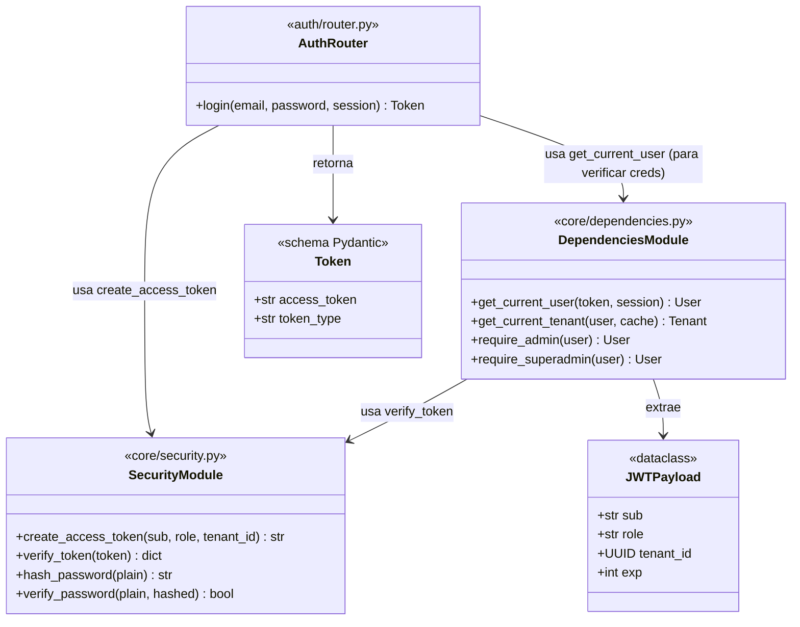
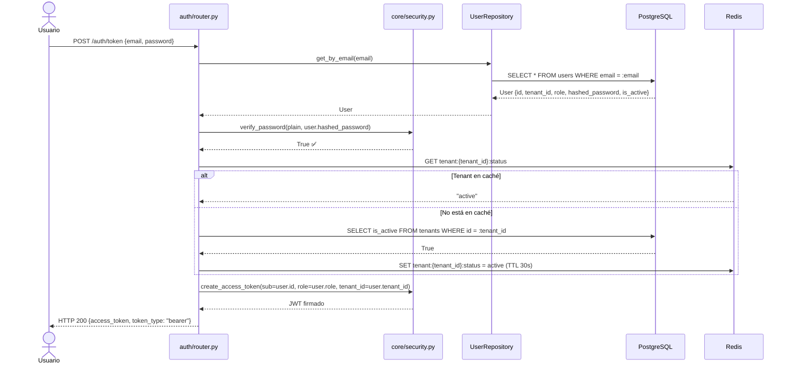
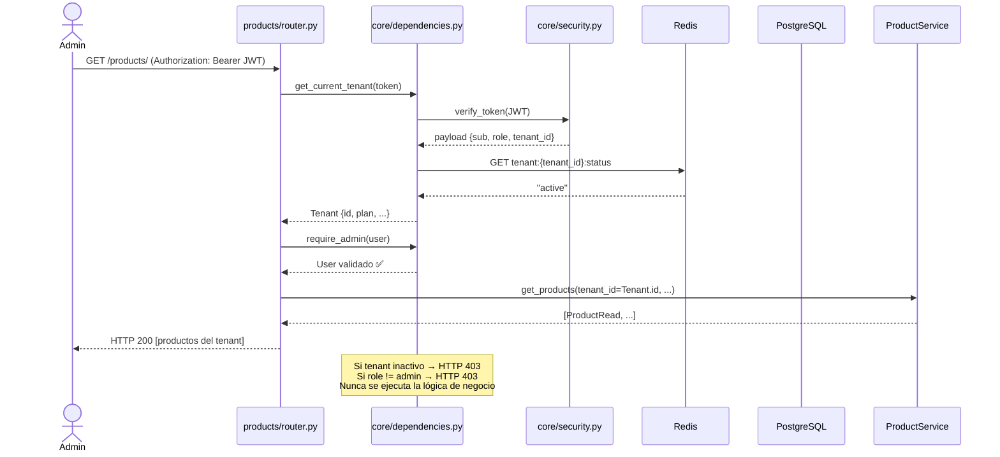

# Iteración ADD-02: Módulo `auth/`
## Proyecto: FastInventory SaaS

---

**Versión:** 1.0  
**Fecha:** 11/04/2026  
**Metodología:** ADD aplicado sobre QAS/ADR de `drivers_arquitectonicos.md`  
**Módulo:** `app/modules/auth/` + `app/core/dependencies.py` + `app/core/security.py`  

---

## Paso 1 — Selección del Elemento a Descomponer

**Elemento:** Módulo `auth/` y las dependencias del `core/` que implementan el sistema de identidad multi-tenant.  
**Justificación de prioridad:** Sin autenticación no hay `tenant_id` en el contexto de cada request. Es el segundo módulo crítico, ya que habilita el flujo `Router → get_current_tenant() → Service → Repository` en todos los módulos restantes.

**Referencia en documentación:**
- `vision_y_alcance.md` — F-03 (Autenticación y RBAC con JWT)
- `drivers_arquitectonicos.md` — CA-01, QAS-02, QAS-03, ADR-03
- `analisis_transicion_saas.md` — Sección 2.3 (JWT con `tenant_id`)

---

## Paso 2 — Identificación de los Drivers Aplicables

| Driver | ID | Impacto en `auth/` |
|---|---|---|
| **RBAC** (Control de acceso por rol) | QAS-02 | Los tres roles (`employee`, `admin`, `superadmin`) deben validarse en el JWT. Un empleado que intenta acceder a un endpoint de admin recibe HTTP 403 sin que se ejecute la lógica de negocio. |
| **Aislamiento de datos** | QAS-03 | El `tenant_id` debe estar en el JWT. Si el token no contiene `tenant_id`, o si el tenant está inactivo, el request debe rechazarse. |
| **Sistema `Depends()` de FastAPI** | CA-01 | El mecanismo de propagación del `tenant_id` es la dependencia `get_current_tenant()`. No se usan variables de hilo ni globales. |
| **Mantenibilidad** | QAS-04 | Las dependencias de autenticación deben ser inyectables e independientes. El cambio del algoritmo de firma no debe afectar los módulos de negocio. |

---

## Paso 3 — Identificación de Conceptos de Diseño Candidatos

| Decisión | Opciones | Decisión tomada | Justificación |
|---|---|---|---|
| Mecanismo de autenticación | Sesiones en servidor / API Keys / JWT | **JWT (stateless)** | CA-01, `analisis_transicion_saas.md` sección 3.3: el diseño stateless es compatible con múltiples workers Uvicorn y con el escalado horizontal. |
| Contenido del JWT | Solo `sub` + `role` / `sub` + `role` + `tenant_id` | **`sub` + `role` + `tenant_id`** | QAS-03: el `tenant_id` debe estar en el token para no necesitar una query SQL adicional por request. |
| Estrategia de expiración | Token de larga duración / Access + Refresh token | **Solo Access token (v2.0)** | Simplicidad para el MVP. Los refresh tokens se implementarán en v2.1. |
| Verificación de estado del tenant | Verificar en cada request via BD / via Redis | **Redis con TTL 30s + fallback BD** | CA-08, ADR-07: el estado del tenant (`is_active`) se lee de Redis para no penalizar el rendimiento. |
| Protección de endpoints | Middleware global / Dependencia inyectable | **Dependencias FastAPI (`Depends`)** | CA-01: el sistema `Depends()` es el mecanismo canónico. Permite diferenciación por endpoint. |

---

## Paso 4 — Instanciación de los Conceptos y Asignación de Responsabilidades

### 4.1 Estructura de archivos

```
app/
├── core/
│   ├── security.py           # Crear y verificar JWT. Hashear/verificar passwords.
│   └── dependencies.py       # Dependencias FastAPI inyectables por endpoint.
└── modules/
    └── auth/
        └── router.py         # POST /auth/token (login)
```

### 4.2 Responsabilidades por archivo

| Archivo | Responsabilidades |
|---|---|
| `core/security.py` | `create_access_token(sub, role, tenant_id)`. `verify_token(token) → payload`. `hash_password()`. `verify_password()`. Sin conocimiento de HTTP ni BD. |
| `core/dependencies.py` | `get_current_user()`: extrae y valida el JWT. Retorna el usuario de BD. `get_current_tenant()`: extrae `tenant_id` del token y verifica `is_active` en Redis/BD. `require_admin()`: valida `role == "admin"`. `require_superadmin()`: valida `role == "superadmin"`. |
| `auth/router.py` | `POST /auth/token`: recibe email + password, verifica credenciales, retorna JWT con `tenant_id`. |

### 4.3 Payload del JWT

```json
{
  "sub": "uuid-del-usuario",
  "role": "admin",
  "tenant_id": "uuid-del-tenant",
  "exp": 1234567890
}
```

> **Regla de seguridad:** El `tenant_id` siempre proviene del JWT firmado, **nunca** del cuerpo de la petición ni de un header custom. Firmar con `HS256` + secret configurable via variable de entorno `SECRET_KEY`.

---

## Paso 5 — Definición de las Interfaces

### 5.1 `core/security.py`

```python
def create_access_token(
    sub: str,           # UUID del usuario
    role: str,          # "employee" | "admin" | "superadmin"
    tenant_id: str | None,  # None solo para superadmin
    expires_delta: timedelta = timedelta(hours=8)
) -> str:
    """Genera un JWT firmado con HS256."""

def verify_token(token: str) -> dict:
    """Verifica firma y expiración. Retorna el payload o lanza HTTPException 401."""

def hash_password(plain: str) -> str
def verify_password(plain: str, hashed: str) -> bool
```

### 5.2 `core/dependencies.py`

```python
async def get_current_user(
    token: str = Depends(oauth2_scheme),
    session: AsyncSession = Depends(get_db)
) -> User:
    """Valida JWT → obtiene usuario de BD → retorna User."""

async def get_current_tenant(
    current_user: User = Depends(get_current_user),
    cache: Redis = Depends(get_cache)
) -> Tenant:
    """Verifica que tenant_id del JWT sea un tenant activo (Redis → BD fallback).
    Lanza HTTP 403 si el tenant está suspendido."""

async def require_admin(
    current_user: User = Depends(get_current_user)
) -> User:
    """Lanza HTTP 403 si role != 'admin'."""

async def require_superadmin(
    current_user: User = Depends(get_current_user)
) -> User:
    """Lanza HTTP 403 si role != 'superadmin'. No verifica tenant_id."""
```

---

## Paso 6 — Boceto de Vistas Arquitectónicas

### 6.1 Diagrama de Clases — Sistema de Identidad



### 6.2 Diagrama de Secuencia — Login y propagación del `tenant_id`



### 6.3 Diagrama de Secuencia — Uso de dependencias en un endpoint protegido



---

## Paso 7 — Análisis de Drivers Satisfechos

| Driver | ¿Satisfecho? | Evidencia en el diseño |
|---|:---:|---|
| **QAS-02** RBAC | ✅ | `require_admin` y `require_superadmin` como dependencias inyectables. HTTP 403 antes de ejecutar lógica de negocio. |
| **QAS-03** Aislamiento | ✅ | `tenant_id` en el JWT. `get_current_tenant()` verifica `is_active` antes de cada request. Admin de tenant A nunca obtiene datos de tenant B. |
| **CA-01** Sistema `Depends()` | ✅ | Toda la cadena de autenticación es via `Depends()`. Propagación por inyección de dependencias, sin variables globales. |
| **CA-08** Redis fallback | ✅ | `get_current_tenant()` consulta Redis primero; si no está disponible, consulta PostgreSQL directamente (con log de advertencia). |

---

## Paso 8 — Trabajo Pendiente para Próximas Iteraciones

| Módulo | Dependencia de `auth/` | Acción |
|---|---|---|
| Todos los módulos | Usan `Depends(get_current_tenant)` y `Depends(require_admin)` | Confirmado el contrato de las dependencias. Todos los routers lo usan a partir de `iter-03`. |
| `users/` | Login de empleado no incluye `tenant_id` si el endpoint es público | **iter-03:** El endpoint de login del empleado verifica que el user pertenece al tenant correcto antes de emitir el token. |
| `admin/` | `require_superadmin` no verifica `tenant_id` | **iter-08:** Es la única excepción explícita y documentada (ADR-01). |

---

## Resumen de la Iteración

```
┌──────────────────────────────────────────────────────┐
│           RESULTADO ADD-02: Módulo auth/              │
├──────────────────┬───────────────────────────────────┤
│ Drivers cubiertos│ QAS-02, QAS-03, CA-01, CA-08      │
│ Archivos definidos│ auth/router.py                   │
│                  │ core/security.py                   │
│                  │ core/dependencies.py               │
│ Endpoints        │ POST /auth/token                   │
│ JWT payload      │ sub + role + tenant_id             │
│ Dependencias     │ get_current_user                   │
│                  │ get_current_tenant                 │
│                  │ require_admin                      │
│                  │ require_superadmin                 │
│ Diagramas        │ Clases ✅ Secuencia ✅             │
│ Próxima iter.    │ iter-03_modulo-users.md            │
└──────────────────┴───────────────────────────────────┘
```

---

*Iteración ADD-02 — Método ADD aplicado sobre QAS/ADR de `drivers_arquitectonicos.md` v2.0.*  
*Siguiente: `iter-03_modulo-users.md`*
