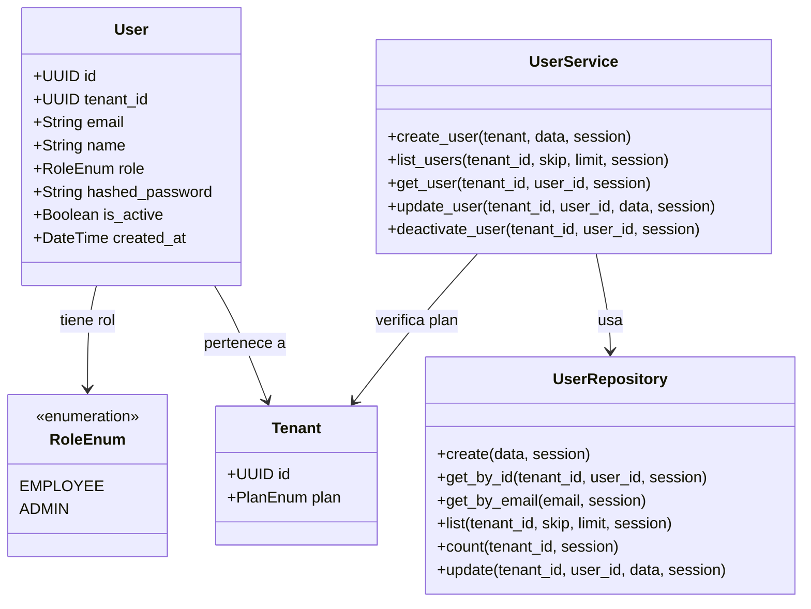
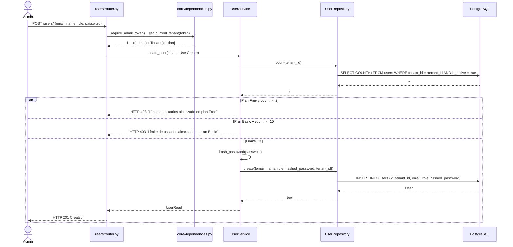

# Iteración ADD-03: Módulo `users/`
## Proyecto: FastInventory SaaS

---

**Versión:** 1.0  
**Fecha:** 11/04/2026  
**Módulo:** `app/modules/users/`

---

## Paso 1 — Selección del Elemento a Descomponer

**Elemento:** Módulo `users/` — gestión de usuarios scoped al tenant.  
**Justificación:** Los usuarios son el primer recurso de negocio con `tenant_id` FK. Su diseño establece el patrón que seguirán `categories/`, `products/`, `sales/` y `reports/`.

**Referencia:** `vision_y_alcance.md` F-03 (RBAC), SRS RF-03 (CRUD Usuarios), `drivers_arquitectonicos.md` QAS-02, QAS-03.

---

## Paso 2 — Drivers Aplicables

| Driver | ID | Impacto |
|---|---|---|
| **Aislamiento** | QAS-03 | Un Admin solo puede ver/crear/editar usuarios de su propio tenant. Nunca de otro. |
| **RBAC** | QAS-02 | Solo el Admin del tenant puede gestionar usuarios. Los empleados no tienen acceso a este módulo. |
| **Límites de plan** | F-07 | Free: máx 2 usuarios. Basic: máx 10. Pro: ilimitado. El Service verifica el límite antes de crear. |
| **Mantenibilidad** | QAS-04 | Patrón `Router → Service → Repository` estricto, igual que todos los módulos. |

---

## Paso 3 — Conceptos de Diseño

| Decisión | Decisión tomada | Justificación |
|---|---|---|
| Scope de users | Scoped por `tenant_id` | CA-02: `users.tenant_id FK → tenants.id`. El repositorio filtra siempre por `tenant_id`. |
| Creación de usuarios | Solo el Admin de su tenant puede crear usuarios | QAS-02 + F-03: `require_admin` en todos los endpoints. |
| Validación de límite de plan | En `UserService` antes del INSERT | El Service consulta el plan del tenant y el count actual antes de crear. |
| Contraseña inicial | El Admin asigna contraseña inicial al empleado | Simplicidad para v2.0. El hash se genera en `UserService` usando `core/security.py`. |

---

## Paso 4 — Responsabilidades

### 4.1 Estructura de archivos

```
app/modules/users/
├── router.py       # CRUD /users/ protegido con require_admin + get_current_tenant
├── service.py      # Validar límite de plan, gestionar CRUD
├── repository.py   # Queries con WHERE tenant_id = :tenant_id
├── models.py       # Modelo SQLAlchemy: User (con tenant_id FK)
└── schemas.py      # UserCreate, UserRead, UserUpdate, RoleEnum
```

### 4.2 Endpoints

| Método | Ruta | Descripción |
|---|---|---|
| `POST` | `/users/` | Crear usuario en el tenant del Admin autenticado |
| `GET` | `/users/` | Listar usuarios del tenant (paginado) |
| `GET` | `/users/{user_id}` | Obtener detalle de un usuario del tenant |
| `PUT` | `/users/{user_id}` | Actualizar datos del usuario |
| `DELETE` | `/users/{user_id}` | Desactivar usuario (soft delete) |

---

## Paso 5 — Interfaces

```python
class UserService:
    async def create_user(self, tenant: Tenant, data: UserCreate, session) -> UserRead:
        """Verifica límite de plan → hash password → INSERT → retorna UserRead."""

    async def list_users(self, tenant_id: UUID, skip: int, limit: int, session) -> list[UserRead]

    async def get_user(self, tenant_id: UUID, user_id: UUID, session) -> UserRead

    async def update_user(self, tenant_id: UUID, user_id: UUID, data: UserUpdate, session) -> UserRead

    async def deactivate_user(self, tenant_id: UUID, user_id: UUID, session) -> None

class UserRepository:
    async def create(self, data: dict, session) -> User
    async def get_by_id(self, tenant_id: UUID, user_id: UUID, session) -> User | None
    async def get_by_email(self, email: str, session) -> User | None
    async def list(self, tenant_id: UUID, skip: int, limit: int, session) -> list[User]
    async def count(self, tenant_id: UUID, session) -> int
    async def update(self, tenant_id: UUID, user_id: UUID, data: dict, session) -> User
```

---

## Paso 6 — Boceto de Vistas Arquitectónicas

### 6.1 Diagrama de Clases



### 6.2 Diagrama de Secuencia — Crear usuario con validación de plan



---

## Paso 7 — Análisis de Drivers Satisfechos

| Driver | ¿Satisfecho? | Evidencia |
|---|:---:|---|
| **QAS-03** Aislamiento | ✅ | `UserRepository` filtra siempre `WHERE tenant_id = :tenant_id`. |
| **QAS-02** RBAC | ✅ | `require_admin` en todos los endpoints de `/users/`. HTTP 403 antes de ejecutar lógica. |
| **F-07** Límites de plan | ✅ | `UserService.create_user()` verifica `count()` antes de insertar. |

---

## Paso 8 — Trabajo Pendiente

| Módulo | Acción |
|---|---|
| `categories/` | El patrón `Router → Service → Repository` con `tenant_id` se replica idénticamente. **iter-04.** |
| `products/` | Requiere verificar límite de productos por plan. **iter-05.** |

---

## Resumen

```
┌──────────────────────────────────────────────────────┐
│           RESULTADO ADD-03: Módulo users/             │
├──────────────────┬───────────────────────────────────┤
│ Drivers cubiertos│ QAS-02, QAS-03, F-07              │
│ Endpoints        │ CRUD /users/ (5 endpoints)        │
│ Diagramas        │ Clases ✅ Secuencia ✅             │
│ Próxima iter.    │ iter-04_modulo-categories.md      │
└──────────────────┴───────────────────────────────────┘
```

*Siguiente: `iter-04_modulo-categories.md`*
