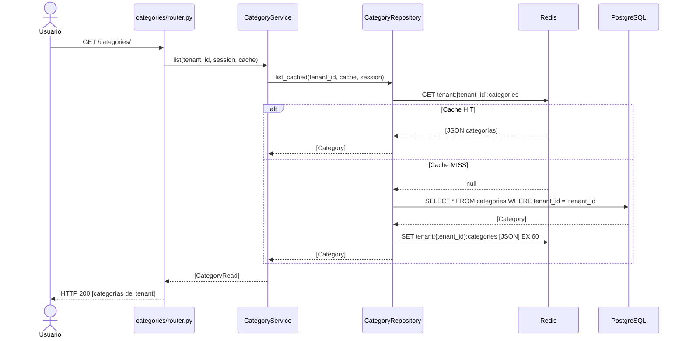

# Iteración ADD-04: Módulo `categories/`
## Proyecto: FastInventory SaaS

---

**Versión:** 1.0  
**Fecha:** 11/04/2026  
**Módulo:** `app/modules/categories/`

---

## Paso 1 — Selección del Elemento a Descomponer

**Elemento:** Módulo `categories/` — agrupación de productos por dominio del tenant.  
**Justificación:** Las categorías son el recurso más leído del sistema (cada búsqueda de productos las consulta). Introduce el patrón de **caché Redis por tenant**, que luego `products/` y `reports/` heredarán.

**Referencia:** `vision_y_alcance.md` F-04, `drivers_arquitectonicos.md` CA-08, QAS-05, ADR-07.

---

## Paso 2 — Drivers Aplicables

| Driver | ID | Impacto |
|---|---|---|
| **Desempeño en lectura** | QAS-05 | Las categorías se consultan constantemente (navegación de productos). Se cachean en Redis con TTL 60s, scoped por `tenant_id`. |
| **Aislamiento** | QAS-03 | Las categorías de un tenant son invisibles para cualquier otro tenant. |
| **RBAC** | QAS-02 | Solo el Admin puede crear/editar/eliminar. Empleados y Admin pueden listar. |
| **Redis fallback** | CA-08 | Si Redis no está disponible, el repositorio consulta PostgreSQL directamente. |

---

## Paso 3 — Conceptos de Diseño

| Decisión | Decisión tomada | Justificación |
|---|---|---|
| Estrategia de caché | Redis por tenant con clave `tenant:{id}:categories` | ADR-07: TTL 60s. La invalidación al crear/editar/eliminar se hace borrando la clave del tenant específico. Sin afectar a otros tenants. |
| Scope | `category.tenant_id FK → tenants.id` | CA-02. |
| Eliminación | Soft delete si tiene productos asociados / Hard delete si no | Integridad referencial: no se puede eliminar una categoría que tiene productos activos. |

---

## Paso 4 — Responsabilidades

### 4.1 Estructura de archivos

```
app/modules/categories/
├── router.py       # CRUD /categories/
├── service.py      # Validar integridad al eliminar
├── repository.py   # Queries + caché Redis
├── models.py       # Category {id, tenant_id, name, description}
└── schemas.py      # CategoryCreate, CategoryRead, CategoryUpdate
```

### 4.2 Endpoints

| Método | Ruta | Protección | Descripción |
|---|---|---|---|
| `POST` | `/categories/` | `require_admin` | Crear categoría en el tenant |
| `GET` | `/categories/` | `get_current_tenant` | Listar categorías del tenant (desde caché) |
| `GET` | `/categories/{id}` | `get_current_tenant` | Detalle de categoría |
| `PUT` | `/categories/{id}` | `require_admin` | Actualizar categoría (invalida caché) |
| `DELETE` | `/categories/{id}` | `require_admin` | Eliminar si no tiene productos activos |

---

## Paso 5 — Interfaces

```python
class CategoryRepository:
    async def list_cached(self, tenant_id: UUID, cache: Redis, session) -> list[Category]:
        """1. GET tenant:{tenant_id}:categories desde Redis.
           2. Si cache miss → consulta BD → SET en Redis (TTL 60s) → retorna.
           3. Si Redis no disponible → consulta BD directamente."""

    async def invalidate_cache(self, tenant_id: UUID, cache: Redis) -> None:
        """DEL tenant:{tenant_id}:categories"""

    async def create(self, data: dict, session) -> Category  # + invalidate_cache
    async def update(self, tenant_id: UUID, cat_id: UUID, data: dict, session) -> Category  # + invalidate_cache
    async def delete(self, tenant_id: UUID, cat_id: UUID, session) -> None  # + invalidate_cache
    async def has_products(self, tenant_id: UUID, cat_id: UUID, session) -> bool
```

---

## Paso 6 — Boceto de Vistas Arquitectónicas

### 6.1 Diagrama de Clases

```mermaid
classDiagram
    class Category {
        +UUID id
        +UUID tenant_id
        +String name
        +Text description
    }

    class CategoryService {
        +create(tenant_id, data, session, cache)
        +list(tenant_id, session, cache)
        +get(tenant_id, cat_id, session)
        +update(tenant_id, cat_id, data, session, cache)
        +delete(tenant_id, cat_id, session, cache)
    }

    class CategoryRepository {
        +list_cached(tenant_id, cache, session)
        +invalidate_cache(tenant_id, cache)
        +create(data, session)
        +update(tenant_id, cat_id, data, session)
        +delete(tenant_id, cat_id, session)
        +has_products(tenant_id, cat_id, session)
    }

    class RedisCache {
        <<external>>
        +GET(key)
        +SET(key, value, ttl)
        +DEL(key)
    }

    CategoryService --> CategoryRepository : usa
    CategoryRepository --> RedisCache : cachea por tenant
    Category --> "Tenant" : tenant_id FK
```

### 6.2 Diagrama de Secuencia — Listar categorías con caché



---

## Paso 7 — Análisis de Drivers Satisfechos

| Driver | ¿Satisfecho? | Evidencia |
|---|:---:|---|
| **QAS-05** Desempeño | ✅ | Caché Redis por tenant, TTL 60s. Evita query SQL en cada request. |
| **QAS-03** Aislamiento | ✅ | Clave Redis scoped: `tenant:{id}:categories`. BD filtra `WHERE tenant_id`. Invalidación solo afecta al tenant modificado. |
| **CA-08** Redis fallback | ✅ | `list_cached()` maneja la indisponibilidad de Redis con try/except, consultando BD directamente. |

---

## Resumen

```
┌──────────────────────────────────────────────────────┐
│        RESULTADO ADD-04: Módulo categories/           │
├──────────────────┬───────────────────────────────────┤
│ Drivers cubiertos│ QAS-03, QAS-05, CA-08             │
│ Endpoints        │ CRUD /categories/ (5 endpoints)   │
│ Patrón nuevo     │ Caché Redis por tenant con TTL     │
│ Diagramas        │ Clases ✅ Secuencia ✅             │
│ Próxima iter.    │ iter-05_modulo-products.md        │
└──────────────────┴───────────────────────────────────┘
```

*Siguiente: `iter-05_modulo-products.md`*
