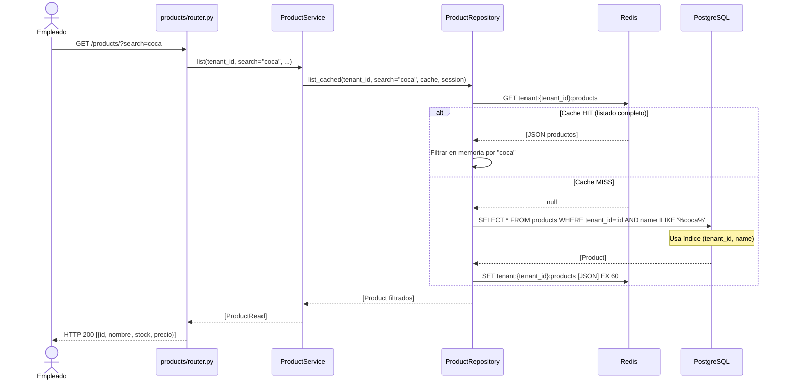

# Iteración ADD-05: Módulo `products/`
## Proyecto: FastInventory SaaS

---

**Versión:** 1.0  
**Fecha:** 11/04/2026  
**Módulo:** `app/modules/products/`

---

## Paso 1 — Selección del Elemento a Descomponer

**Elemento:** Módulo `products/` — catálogo de inventario del tenant.  
**Justificación:** Es el módulo más consultado en el flujo de ventas POS. Combina caché Redis (lectura), límites de plan (escritura) e índice compuesto en BD (`tenant_id`, `name`) para búsqueda eficiente.

**Referencia:** `vision_y_alcance.md` F-04, F-05, F-07 | `drivers_arquitectonicos.md` QAS-05, QAS-03, CA-02.

---

## Paso 2 — Drivers Aplicables

| Driver | ID | Impacto |
|---|---|---|
| **Desempeño en búsqueda** | QAS-05 | P95 ≤ 500ms para 50 tenants simultáneos. Índice `(tenant_id, name)` + caché Redis. |
| **Aislamiento** | QAS-03 | Productos de tenant A son invisibles para tenant B. Filtro `tenant_id` obligatorio. |
| **Límites de plan** | F-07 | Free: 50 productos. Basic: 500. Pro: ilimitado. |
| **Atomicidad de ventas** | QAS-01 | El stock del producto se actualiza dentro de la transacción de venta (`sales/`). El `ProductRepository` expone `decrement_stock()` usable en transacciones externas. |

---

## Paso 3 — Conceptos de Diseño

| Decisión | Decisión tomada | Justificación |
|---|---|---|
| Búsqueda de productos | `ILIKE '%:term%'` + índice `(tenant_id, name)` | QAS-05: la búsqueda predictiva del POS es el caso de uso más crítico de este módulo. |
| Caché de catálogo | Redis `tenant:{id}:products` con TTL 60s | ADR-07: igual que `categories/`. Invalidación al crear/editar/eliminar. |
| Gestión de stock | Campo `stock INTEGER` con validación en `SaleService` | La deducción de stock ocurre en la transacción de venta (iter-06), no en este módulo. |
| Relación con categoría | `category_id FK → categories.id` (nullable) | Un producto puede no tener categoría asignada. |

---

## Paso 4 — Responsabilidades

### 4.1 Estructura de archivos

```
app/modules/products/
├── router.py       # CRUD /products/ + GET /products/?search=&category_id=
├── service.py      # Validar límite de plan, gestionar CRUD
├── repository.py   # Queries + caché + decrement_stock()
├── models.py       # Product {id, tenant_id, category_id, name, description, price, stock, unit}
└── schemas.py      # ProductCreate, ProductRead, ProductUpdate
```

### 4.2 Endpoints

| Método | Ruta | Protección | Descripción |
|---|---|---|---|
| `POST` | `/products/` | `require_admin` | Crear producto (verifica límite de plan) |
| `GET` | `/products/` | `get_current_tenant` | Listar/buscar (`?search=`, `?category_id=`) — con caché |
| `GET` | `/products/{id}` | `get_current_tenant` | Detalle de producto |
| `PUT` | `/products/{id}` | `require_admin` | Actualizar producto (invalida caché) |
| `DELETE` | `/products/{id}` | `require_admin` | Eliminar producto (invalida caché) |

---

## Paso 5 — Interfaces

```python
class ProductRepository:
    async def list_cached(self, tenant_id: UUID, search: str | None,
                          category_id: UUID | None, cache, session) -> list[Product]
    async def invalidate_cache(self, tenant_id: UUID, cache) -> None
    async def create(self, data: dict, session) -> Product
    async def get_by_id(self, tenant_id: UUID, product_id: UUID, session) -> Product | None
    async def update(self, tenant_id: UUID, product_id: UUID, data: dict, session) -> Product
    async def delete(self, tenant_id: UUID, product_id: UUID, session) -> None
    async def count(self, tenant_id: UUID, session) -> int
    async def decrement_stock(self, tenant_id: UUID, product_id: UUID,
                              quantity: int, session: AsyncSession) -> Product
    """Usado por SaleService dentro de su transacción. Verifica tenant_id."""
```

---

## Paso 6 — Boceto de Vistas Arquitectónicas

### 6.1 Diagrama de Clases

```mermaid
classDiagram
    class Product {
        +UUID id
        +UUID tenant_id
        +UUID category_id
        +String name
        +Text description
        +Decimal price
        +Integer stock
        +String unit
    }

    class ProductService {
        +create(tenant, data, session, cache)
        +list(tenant_id, search, category_id, session, cache)
        +get(tenant_id, product_id, session)
        +update(tenant_id, product_id, data, session, cache)
        +delete(tenant_id, product_id, session, cache)
    }

    class ProductRepository {
        +list_cached(tenant_id, search, category_id, cache, session)
        +invalidate_cache(tenant_id, cache)
        +create(data, session)
        +get_by_id(tenant_id, product_id, session)
        +update(tenant_id, product_id, data, session)
        +delete(tenant_id, product_id, session)
        +count(tenant_id, session)
        +decrement_stock(tenant_id, product_id, quantity, session)
    }

    Product --> "Tenant" : tenant_id FK
    Product --> "Category" : category_id FK
    ProductService --> ProductRepository : usa
```

### 6.2 Diagrama de Secuencia — Búsqueda predictiva en POS



---

## Paso 7 — Análisis de Drivers Satisfechos

| Driver | ¿Satisfecho? | Evidencia |
|---|:---:|---|
| **QAS-05** Desempeño | ✅ | Índice `(tenant_id, name)` + caché Redis TTL 60s. |
| **QAS-03** Aislamiento | ✅ | `decrement_stock()` verifica `tenant_id` antes de actualizar stock. |
| **F-07** Límites de plan | ✅ | `ProductService` verifica `count()` antes de crear. |
| **QAS-01** Integración ventas | ✅ | `decrement_stock()` es un método de repositorio reutilizable por `SaleService` dentro de su transacción. |

---

## Resumen

```
┌──────────────────────────────────────────────────────┐
│        RESULTADO ADD-05: Módulo products/             │
├──────────────────┬───────────────────────────────────┤
│ Drivers cubiertos│ QAS-01, QAS-03, QAS-05, F-07      │
│ Endpoints        │ CRUD + búsqueda /products/        │
│ Método clave     │ decrement_stock() para ventas      │
│ Diagramas        │ Clases ✅ Secuencia ✅             │
│ Próxima iter.    │ iter-06_modulo-sales.md           │
└──────────────────┴───────────────────────────────────┘
```

*Siguiente: `iter-06_modulo-sales.md`*
