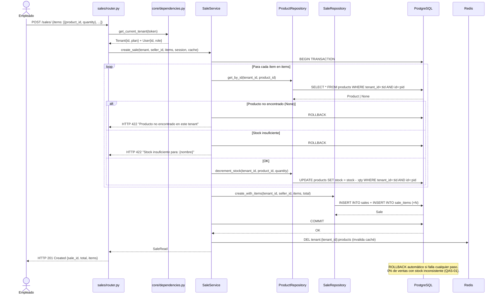

# Iteración ADD-06: Módulo `sales/`
## Proyecto: FastInventory SaaS

---

**Versión:** 1.0  
**Fecha:** 11/04/2026  
**Módulo:** `app/modules/sales/`

---

## Paso 1 — Selección del Elemento a Descomponer

**Elemento:** Módulo `sales/` — motor POS del sistema. Es el módulo de mayor complejidad transaccional.  
**Justificación:** Una venta es la operación más crítica del negocio. Involucra múltiples tablas, validación de stock, descuento atómico y trazabilidad completa. Un error aquí tiene consecuencias directas en el inventario del tenant.

**Referencia:** `vision_y_alcance.md` F-05 | `drivers_arquitectonicos.md` QAS-01, QAS-03, HU-05.

---

## Paso 2 — Drivers Aplicables

| Driver | ID | Impacto |
|---|---|---|
| **Integridad transaccional** | QAS-01 | Si falla la inserción de cualquier `SaleItem` o el descuento de stock del producto N, se hace ROLLBACK completo. 0% de ventas en estado inconsistente. |
| **Aislamiento** | QAS-03 | El `tenant_id` de cada producto se verifica dentro de la transacción antes de descontar su stock. No es posible afectar productos de otro tenant. |
| **RBAC** | QAS-02 | Empleados y Admins pueden registrar ventas. Solo Admins pueden consultar el historial. |
| **Límites de plan (historial)** | F-07 | `GET /sales/` filtra por período según el plan: Free=30 días, Basic=6 meses, Pro=ilimitado. |

---

## Paso 3 — Conceptos de Diseño

| Decisión | Decisión tomada | Justificación |
|---|---|---|
| Atomicidad | `async with session.begin()` en `SaleService` | QAS-01: FastAPI + SQLAlchemy 2.0 async. ROLLBACK automático si algún paso falla. |
| Verificación de `tenant_id` por ítem | `ProductRepository.get_by_id(tenant_id, product_id)` dentro de la transacción | QAS-03: si el `product_id` no pertenece al `tenant_id` del JWT, retorna `None` → HTTP 422 sin revelar la existencia del producto en otro tenant. |
| Modelo de datos | `Sale` (cabecera) + `SaleItem` (detalle n) | F-05: una venta puede incluir múltiples productos en una sola transacción. Ambas tablas tienen `tenant_id`. |
| Invalidación de caché | Al confirmar venta → invalidar caché de productos del tenant | ADR-07: el stock cambió, el caché de productos debe refrescarse. |

---

## Paso 4 — Responsabilidades

### 4.1 Estructura de archivos

```
app/modules/sales/
├── router.py       # POST /sales/, GET /sales/, GET /sales/{id}
├── service.py      # Transacción atómica: validar stock → insertar → descontar
├── repository.py   # Queries en sales y sale_items con WHERE tenant_id
├── models.py       # Sale {id, tenant_id, seller_id, total, created_at}
│                   # SaleItem {id, sale_id, tenant_id, product_id, quantity, unit_price}
└── schemas.py      # SaleCreate, SaleItemInput, SaleRead, SaleItemRead
```

### 4.2 Endpoints

| Método | Ruta | Protección | Descripción |
|---|---|---|---|
| `POST` | `/sales/` | `get_current_tenant` (employee o admin) | Registrar venta multi-ítem |
| `GET` | `/sales/` | `require_admin` | Historial de ventas (filtrado por plan) |
| `GET` | `/sales/{id}` | `require_admin` | Detalle de una venta |

---

## Paso 5 — Interfaces

```python
class SaleService:
    async def create_sale(
        self,
        tenant: Tenant,
        seller_id: UUID,
        items: list[SaleItemInput],  # [{product_id, quantity}]
        session: AsyncSession,
        cache: Redis
    ) -> SaleRead:
        """
        async with session.begin():
          Para cada ítem:
            1. product = ProductRepository.get_by_id(tenant.id, item.product_id)
               → Si None: ROLLBACK + HTTP 422 "Producto no encontrado en este tenant"
            2. Si product.stock < item.quantity: ROLLBACK + HTTP 422 "Stock insuficiente"
            3. ProductRepository.decrement_stock(tenant.id, product.id, item.quantity)
          4. SaleRepository.create_with_items(tenant.id, seller_id, items, total)
          5. COMMIT
        6. ProductRepository.invalidate_cache(tenant.id, cache)  [fuera de la TX]
        """

class SaleRepository:
    async def create_with_items(self, tenant_id, seller_id, items, total, session) -> Sale
    async def get_by_id(self, tenant_id: UUID, sale_id: UUID, session) -> Sale | None
    async def list(self, tenant_id: UUID, from_date: datetime, session) -> list[Sale]
```

---

## Paso 6 — Boceto de Vistas Arquitectónicas

### 6.1 Diagrama de Clases

```mermaid
classDiagram
    class Sale {
        +UUID id
        +UUID tenant_id
        +UUID seller_id
        +Decimal total
        +DateTime created_at
    }

    class SaleItem {
        +UUID id
        +UUID sale_id
        +UUID tenant_id
        +UUID product_id
        +Integer quantity
        +Decimal unit_price
    }

    class SaleService {
        +create_sale(tenant, seller_id, items, session, cache)
        +get_sale(tenant_id, sale_id, session)
        +list_sales(tenant_id, from_date, session)
    }

    class SaleRepository {
        +create_with_items(tenant_id, seller_id, items, total, session)
        +get_by_id(tenant_id, sale_id, session)
        +list(tenant_id, from_date, session)
    }

    class SaleItemInput {
        <<schema Pydantic>>
        +UUID product_id
        +Integer quantity
    }

    Sale --> SaleItem : contiene
    Sale --> "Tenant" : tenant_id FK
    SaleItem --> "Tenant" : tenant_id FK
    SaleItem --> "Product" : product_id FK
    SaleService --> SaleRepository : usa
    SaleService --> "ProductRepository" : decrement_stock
```

### 6.2 Diagrama de Secuencia — Registro de venta multi-ítem (flujo crítico del POS)



---

## Paso 7 — Análisis de Drivers Satisfechos

| Driver | ¿Satisfecho? | Evidencia |
|---|:---:|---|
| **QAS-01** Integridad transaccional | ✅ | `async with session.begin()` en `SaleService`. ROLLBACK automático si cualquier paso falla. Diagrama muestra los casos de error. |
| **QAS-03** Aislamiento | ✅ | `get_by_id(tenant_id, product_id)` dentro de la transacción. Un `product_id` de otro tenant retorna `None` → HTTP 422. |
| **QAS-02** RBAC | ✅ | Empleados pueden vender. Solo Admins consultan historial. |
| **F-07** Límites de historial | ✅ | `list()` recibe `from_date` calculada en `SaleService` según el plan del tenant. |

---

## Resumen

```
┌──────────────────────────────────────────────────────┐
│         RESULTADO ADD-06: Módulo sales/               │
├──────────────────┬───────────────────────────────────┤
│ Drivers cubiertos│ QAS-01, QAS-02, QAS-03, F-07      │
│ Endpoints        │ POST + GET historial + GET detalle │
│ Patrón crítico   │ Transacción atómica multi-ítem     │
│ Diagramas        │ Clases ✅ Secuencia ✅             │
│ Próxima iter.    │ iter-07_modulo-reports.md         │
└──────────────────┴───────────────────────────────────┘
```

*Siguiente: `iter-07_modulo-reports.md`*
