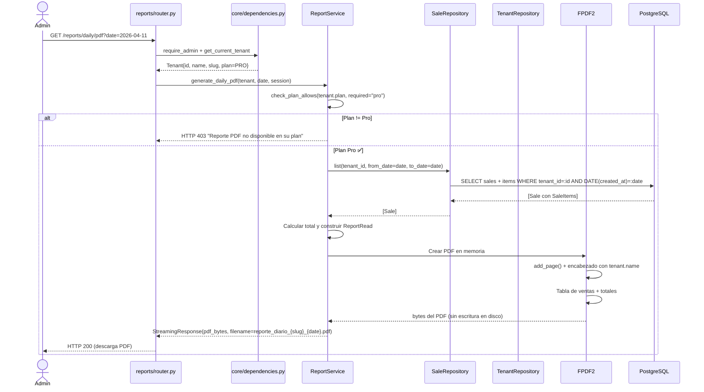

# Iteración ADD-07: Módulo `reports/`
## Proyecto: FastInventory SaaS

---

**Versión:** 1.0  
**Fecha:** 11/04/2026  
**Módulo:** `app/modules/reports/`

---

## Paso 1 — Selección del Elemento a Descomponer

**Elemento:** Módulo `reports/` — generación de reportes de ventas y exportación PDF.  
**Justificación:** Es el módulo con mayor costo computacional (agrega ventas de un período). Combina restricciones de plan (qué reportes están disponibles), generación de PDF en memoria con FPDF2 y el nombre del negocio leído desde `tenants.name`.

**Referencia:** `vision_y_alcance.md` F-06 | `drivers_arquitectonicos.md` CA-06, ADR-05, QAS-03.

---

## Paso 2 — Drivers Aplicables

| Driver | ID | Impacto |
|---|---|---|
| **Restricción de plan** | F-06, F-07 | Free: solo reporte diario. Basic: diario + quincenal. Pro: todos + PDF. La validación ocurre antes de la query SQL costosa. |
| **PDF en memoria** | CA-06, ADR-05 | Sin escritura en disco. El nombre del negocio se lee de `tenants.name`, no de una variable de entorno. |
| **Aislamiento** | QAS-03 | Todas las queries de reportes incluyen `WHERE tenant_id = :tenant_id`. El PDF incluye el `slug` del tenant en el nombre de archivo. |
| **Mantenibilidad** | QAS-04 | El módulo no tiene `repository.py` propio — lee desde `SaleRepository`. Evita duplicación de queries. |

---

## Paso 3 — Conceptos de Diseño

| Decisión | Decisión tomada | Justificación |
|---|---|---|
| Generación de PDF | FPDF2 en memoria + `StreamingResponse` | ADR-05: sin estado en disco, compatible con escalado horizontal. |
| Nombre del negocio en PDF | Leído de `tenants.name` vía `TenantRepository.get_by_id()` | ADR-05: un entorno con múltiples tenants no puede usar `BUSINESS_NAME` como variable global. |
| Nombre del archivo PDF | `reporte_diario_{tenant_slug}_{fecha}.pdf` | QAS-03: distingue reportes entre tenants si se descargan en el mismo cliente. |
| Validación de plan | En `ReportService` antes de ejecutar la query | Si el plan no permite el reporte → HTTP 403 sin ejecutar la query SQL costosa. |
| Repositorio de datos | Reutiliza `SaleRepository.list()` | No se duplican queries. |

---

## Paso 4 — Responsabilidades

### 4.1 Estructura de archivos

```
app/modules/reports/
├── router.py       # GET /reports/daily, /biweekly, /monthly, /daily/pdf
├── service.py      # Validar plan → construir reporte → generar PDF
└── schemas.py      # ReportRead, ReportItemRead
```

> **Nota:** No hay `repository.py` ni `models.py` propios. Los datos se obtienen de `SaleRepository` y `TenantRepository`.

### 4.2 Endpoints

| Método | Ruta | Protección | Plan requerido | Descripción |
|---|---|---|---|---|
| `GET` | `/reports/daily` | `require_admin` | Free/Basic/Pro | Reporte del día (o fecha indicada) en JSON |
| `GET` | `/reports/biweekly` | `require_admin` | Basic/Pro | Últimos 15 días en JSON |
| `GET` | `/reports/monthly` | `require_admin` | Basic/Pro | Últimos 30 días en JSON |
| `GET` | `/reports/daily/pdf` | `require_admin` | Pro | Reporte diario en PDF (StreamingResponse) |

---

## Paso 5 — Interfaces

```python
class ReportService:
    async def get_daily_report(
        self, tenant: Tenant, date: date, session
    ) -> ReportRead:
        """Cualquier plan. Agrega ventas del día del tenant."""

    async def get_biweekly_report(self, tenant: Tenant, session) -> ReportRead:
        """Plan Basic o Pro. HTTP 403 si plan == Free."""

    async def get_monthly_report(self, tenant: Tenant, session) -> ReportRead:
        """Plan Basic o Pro. HTTP 403 si plan == Free."""

    async def generate_daily_pdf(
        self, tenant: Tenant, date: date, session
    ) -> StreamingResponse:
        """
        Plan Pro únicamente. HTTP 403 si plan != Pro.
        1. Llamar a get_daily_report() para obtener datos.
        2. Leer tenant.name de la BD (ya contenido en Tenant).
        3. Generar PDF en memoria con FPDF2.
        4. Retornar StreamingResponse con Content-Disposition:
           attachment; filename=reporte_diario_{tenant.slug}_{date}.pdf
        """
```

---

## Paso 6 — Boceto de Vistas Arquitectónicas

### 6.1 Diagrama de Clases

```mermaid
classDiagram
    class ReportService {
        +get_daily_report(tenant, date, session) ReportRead
        +get_biweekly_report(tenant, session) ReportRead
        +get_monthly_report(tenant, session) ReportRead
        +generate_daily_pdf(tenant, date, session) StreamingResponse
    }

    class ReportRead {
        <<schema Pydantic>>
        +date period_start
        +date period_end
        +Decimal total
        +Integer total_sales
        +list~ReportItemRead~ items
    }

    class FPDF2 {
        <<external lib>>
        +add_page()
        +cell(text)
        +output() bytes
    }

    class PlanValidator {
        <<helper interno>>
        +check_plan_allows(tenant_plan, required_plan)
    }

    ReportService --> "SaleRepository" : obtiene ventas
    ReportService --> "TenantRepository" : obtiene tenant.name
    ReportService --> FPDF2 : genera PDF
    ReportService --> PlanValidator : valida acceso
    ReportService --> ReportRead : construye
```

### 6.2 Diagrama de Secuencia — Generar PDF (flujo del plan Pro)



---

## Paso 7 — Análisis de Drivers Satisfechos

| Driver | ¿Satisfecho? | Evidencia |
|---|:---:|---|
| **CA-06** PDF en memoria | ✅ | FPDF2 genera `bytes` en memoria. `StreamingResponse` sin escritura a disco. |
| **ADR-05** Nombre desde BD | ✅ | `tenant.name` viene del objeto `Tenant` recibido por `get_current_tenant()`. No hay variable global. |
| **QAS-03** Aislamiento | ✅ | `SaleRepository.list()` filtra `WHERE tenant_id`. El nombre del archivo incluye `tenant.slug`. |
| **F-07** Límites de plan | ✅ | `check_plan_allows()` valida antes de la query SQL. HTTP 403 en plan insuficiente. |

---

## Resumen

```
┌──────────────────────────────────────────────────────┐
│         RESULTADO ADD-07: Módulo reports/             │
├──────────────────┬───────────────────────────────────┤
│ Drivers cubiertos│ CA-06, ADR-05, QAS-03, F-07       │
│ Endpoints        │ 3 JSON + 1 PDF (StreamingResponse) │
│ Sin modelo propio│ Reutiliza SaleRepository           │
│ Diagramas        │ Clases ✅ Secuencia ✅             │
│ Próxima iter.    │ iter-08_modulo-admin.md           │
└──────────────────┴───────────────────────────────────┘
```

*Siguiente: `iter-08_modulo-admin.md`*
