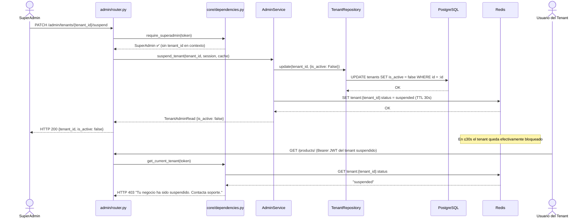

# Iteración ADD-08: Módulo `admin/`
## Proyecto: FastInventory SaaS

---

**Versión:** 1.0  
**Fecha:** 11/04/2026  
**Módulo:** `app/modules/admin/`

---

## Paso 1 — Selección del Elemento a Descomponer

**Elemento:** Módulo `admin/` — panel de Super-Administración de la plataforma FastInventory SaaS.  
**Justificación:** Es el único módulo que opera **sin** filtro de `tenant_id`. Esta excepción está documentada explícitamente en ADR-01 y `drivers_arquitectonicos.md` sección 3.3 (RF-07). Requiere diseño cuidadoso para que la excepción no contamine los demás módulos.

**Referencia:** `vision_y_alcance.md` F-08 | `drivers_arquitectonicos.md` RF-07, QAS-02, ADR-01.

---

## Paso 2 — Drivers Aplicables

| Driver | ID | Impacto |
|---|---|---|
| **RBAC — Excepción explícita** | QAS-02, RF-07 | `require_superadmin` reemplaza a `get_current_tenant` en estos endpoints. El Super-Admin no pertenece a ningún tenant. |
| **Aislamiento protegido** | QAS-03 | Aunque el Super-Admin ve todos los tenants, **no puede ver datos de negocio** (productos, ventas, usuarios individuales). Solo gestiona el ciclo de vida de los tenants. |
| **Efecto inmediato de suspensión** | HU-16, HU-17 | Suspender un tenant debe tener efecto en ≤30s (TTL de Redis). La dependencia `get_current_tenant()` verificará el estado en la siguiente ventana de caché. |
| **Mantenibilidad** | QAS-04 | El módulo `admin/` es autónomo. Su `service.py` no llama a módulos de negocio (products, sales). Solo interactúa con `TenantRepository`. |

---

## Paso 3 — Conceptos de Diseño

| Decisión | Decisión tomada | Justificación |
|---|---|---|
| Ausencia de filtro `tenant_id` | Documentado como excepción explícita | ADR-01, RF-07: es la única excepción. Todos los demás módulos filtran por `tenant_id`. |
| Efecto de suspensión | Invalidar caché Redis del tenant suspendido | CA-08: `get_current_tenant()` consulta Redis. Si el estado en Redis dice `suspended`, se retorna HTTP 403 en el siguiente request del tenant. |
| Cambio de plan | Actualizar `tenants.plan` + invalidar caché | El nuevo plan tiene efecto al siguiente request. No requiere relogin del usuario. |
| Auditoría de cambios | Log en `PlanAuditLog` (tabla simple) | Trazabilidad de quién cambió el plan y cuándo. Mencionado en `models.py` de `tenants/`. |

---

## Paso 4 — Responsabilidades

### 4.1 Estructura de archivos

```
app/modules/admin/
├── router.py       # Endpoints /admin/tenants/...
├── service.py      # Lógica de suspensión, cambio de plan, métricas
└── schemas.py      # TenantAdminRead, PlanChangeRequest, MetricsRead
```

> **Nota:** `admin/` no tiene `repository.py` propio. Usa `TenantRepository` del módulo `tenants/`.

### 4.2 Endpoints

| Método | Ruta | Protección | Descripción |
|---|---|---|---|
| `GET` | `/admin/tenants` | `require_superadmin` | Listar todos los tenants con estado y plan |
| `GET` | `/admin/tenants/{id}` | `require_superadmin` | Detalle de un tenant específico |
| `PATCH` | `/admin/tenants/{id}/suspend` | `require_superadmin` | Suspender tenant + invalida caché Redis |
| `PATCH` | `/admin/tenants/{id}/activate` | `require_superadmin` | Reactivar tenant + actualiza caché Redis |
| `PATCH` | `/admin/tenants/{id}/change-plan` | `require_superadmin` | Cambiar plan + registra en `PlanAuditLog` |
| `GET` | `/admin/metrics` | `require_superadmin` | Métricas globales: tenants activos, volumen de ventas |

---

## Paso 5 — Interfaces

```python
class AdminService:
    async def list_tenants(
        self, skip: int, limit: int, session
    ) -> list[TenantAdminRead]:
        """Sin filtro tenant_id. Acceso a todos los tenants."""

    async def suspend_tenant(
        self, tenant_id: UUID, session, cache
    ) -> TenantAdminRead:
        """
        1. TenantRepository.update(tenant_id, {is_active: False})
        2. Cache: SET tenant:{tenant_id}:status = suspended (TTL 30s)
        3. Efecto en ≤30s en todos los requests activos del tenant.
        """

    async def activate_tenant(self, tenant_id: UUID, session, cache) -> TenantAdminRead

    async def change_plan(
        self, tenant_id: UUID, new_plan: PlanEnum, session, cache
    ) -> TenantAdminRead:
        """
        1. TenantRepository.update(tenant_id, {plan: new_plan})
        2. INSERT INTO plan_audit_log (tenant_id, old_plan, new_plan, changed_by, changed_at)
        3. Cache: DEL tenant:{tenant_id}:* (invalida todo el caché del tenant)
        """

    async def get_metrics(self, session) -> MetricsRead:
        """COUNT(tenants WHERE is_active), SUM(ventas del día), etc."""
```

---

## Paso 6 — Boceto de Vistas Arquitectónicas

### 6.1 Diagrama de Clases

```mermaid
classDiagram
    class AdminService {
        +list_tenants(skip, limit, session)
        +get_tenant(tenant_id, session)
        +suspend_tenant(tenant_id, session, cache)
        +activate_tenant(tenant_id, session, cache)
        +change_plan(tenant_id, new_plan, session, cache)
        +get_metrics(session)
    }

    class TenantAdminRead {
        <<schema Pydantic>>
        +UUID id
        +String name
        +String slug
        +PlanEnum plan
        +Boolean is_active
        +DateTime created_at
    }

    class MetricsRead {
        <<schema Pydantic>>
        +Integer active_tenants
        +Integer suspended_tenants
        +Integer total_tenants
        +Decimal daily_sales_volume
    }

    class PlanAuditLog {
        +UUID id
        +UUID tenant_id
        +PlanEnum old_plan
        +PlanEnum new_plan
        +UUID changed_by
        +DateTime changed_at
    }

    class SuperAdmin {
        <<actor>>
        +role: superadmin
        +tenant_id: None
    }

    AdminService --> "TenantRepository" : usa (sin filtro tenant_id)
    AdminService --> PlanAuditLog : registra cambio de plan
    AdminService --> "Redis" : invalida caché del tenant
    SuperAdmin --> AdminService : opera
    AdminService --> TenantAdminRead : retorna
    AdminService --> MetricsRead : retorna
```

### 6.2 Diagrama de Secuencia — Suspender tenant con efecto inmediato



---

## Paso 7 — Análisis de Drivers Satisfechos

| Driver | ¿Satisfecho? | Evidencia |
|---|:---:|---|
| **QAS-02** RBAC Excepción | ✅ | `require_superadmin` en todos los endpoints. El Super-Admin no tiene `tenant_id`. Excepción documentada en RF-07 y ADR-01. |
| **QAS-03** Aislamiento protegido | ✅ | El Super-Admin solo accede a metadatos del tenant (estado, plan). No puede ver productos, ventas ni usuarios de ningún tenant. |
| **HU-16/17** Suspensión inmediata | ✅ | Invalidación del caché Redis con TTL 30s (CA-08). Efecto en todos los workers de Uvicorn en ≤30s. |
| **QAS-04** Mantenibilidad | ✅ | `admin/` usa `TenantRepository` existente. No duplica lógica. Módulo autónomo y aislado. |

---

## Paso 8 — Cierre del Proceso ADD

Con la iteración ADD-08 se completa el diseño detallado de todos los módulos del sistema. La siguiente tabla muestra el estado final del proceso:

| Iteración | Módulo | Drivers cubiertos | Estado |
|:---:|---|---|:---:|
| ADD-01 | `tenants/` | QAS-03, QAS-06, QAS-02, QAS-04 | ✅ |
| ADD-02 | `auth/` | QAS-02, QAS-03, CA-01, CA-08 | ✅ |
| ADD-03 | `users/` | QAS-02, QAS-03, F-07 | ✅ |
| ADD-04 | `categories/` | QAS-03, QAS-05, CA-08 | ✅ |
| ADD-05 | `products/` | QAS-01, QAS-03, QAS-05, F-07 | ✅ |
| ADD-06 | `sales/` | QAS-01, QAS-02, QAS-03, F-07 | ✅ |
| ADD-07 | `reports/` | CA-06, ADR-05, QAS-03, F-07 | ✅ |
| ADD-08 | `admin/` | QAS-02, QAS-03, HU-16/17, QAS-04 | ✅ |

**Todos los QAS (QAS-01 a QAS-06) y restricciones críticas (CA-01, CA-02, CA-06, CA-08) han sido satisfechos al menos en un módulo.**

---

## Resumen Final

```
┌──────────────────────────────────────────────────────┐
│     RESULTADO ADD-08: Módulo admin/ — CIERRE ADD      │
├──────────────────┬───────────────────────────────────┤
│ Drivers cubiertos│ QAS-02, QAS-03, HU-16/17, QAS-04  │
│ Excepción doc.   │ Sin filtro tenant_id (RF-07, ADR-01)│
│ Endpoint clave   │ PATCH /admin/tenants/{id}/suspend  │
│ Diagramas        │ Clases ✅ Secuencia ✅             │
│ PROCESO ADD      │ ✅ COMPLETO (8 iteraciones)        │
└──────────────────┴───────────────────────────────────┘
```

---

*Iteración ADD-08 — Proceso ADD completo para FastInventory SaaS v2.0.*  
*8 módulos diseñados. Todos los QAS satisfechos. Listo para implementación.*
